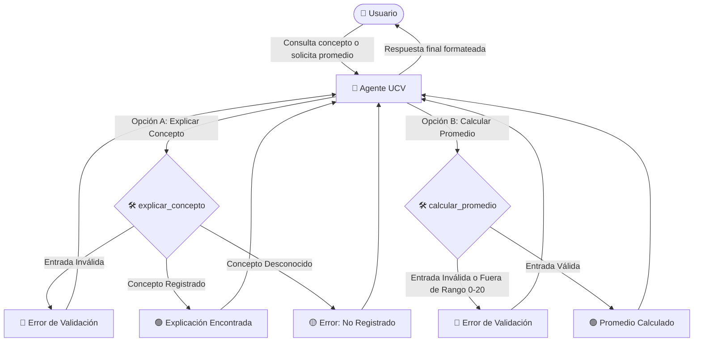

# 🎓 Laboratorio ADK UCV — Asistente Académico Inteligente

[](https://www.python.org/)
[](https://github.com/google/adk)
[](https://opensource.org/licenses/MIT)

Un potente paquete de Python diseñado para ofrecer un **asistente académico en español** utilizando la librería avanzada de agentes **`google-adk`** y el modelo **Gemini Flash**.

Este agente interactivo está preparado para explicar conceptos complejos de informática y calcular promedios de notas académicas utilizando herramientas personalizadas de alta precisión con validación exhaustiva de datos.

---

## 🚀 Arquitectura y Flujo de Trabajo

El siguiente diagrama ilustra cómo el usuario interactúa con el `Agente Académico` y cómo este decide utilizar la herramienta correspondiente (`explicar_concepto` o `calcular_promedio`) gestionando flujos de éxito y errores de validación:



---

## ✨ Características Principales

*   🧠 **Agente Académico Autónomo**: Configurado con `Gemini Flash` para respuestas rápidas e inteligentes.
*   🇪🇸 **Localización Completa**: Instrucciones y respuestas 100% en español con un tono pedagógico y directo.
*   🛠️ **Caja de Herramientas Avanzada**:
    *   `explicar_concepto`: Búsqueda de conceptos técnicos relevantes.
    *   `calcular_promedio`: Motor de cálculo matemático para notas académicas.
*   🛡️ **Validación de Entradas (Seguridad)**: Verificación exhaustiva de tipos de datos, valores nulos, estructuras vacías y rangos numéricos.
*   🧪 **Suite de Pruebas Unificada**: 8 casos de prueba automáticos para validar todos los escenarios posibles de éxito y error.

---

## 📂 Estructura del Proyecto

El repositorio está organizado siguiendo las mejores prácticas de estructuración de paquetes Python:

```bash
UCV-SI-lab8/
│
├── laboratorio-adk-ucv/
│   ├── agente_ucv/
│   │   ├── .adk/               # Base de datos de sesiones y caché del SDK
│   │   ├── __init__.py         # Inicializador del módulo
│   │   └── agent.py            # Definición del agente, lógica de herramientas y validación
│   │
│   └── tests/
│       └── test_agent.py       # Suite de pruebas unitarias exhaustivas con pytest
│
├── pyproject.toml              # Gestión de dependencias y empaquetado (Poetry)
├── poetry.lock                 # Versiones bloqueadas de dependencias
└── README.md                   # Documentación principal (este archivo)
```

---

## 🛠️ Instalación y Configuración

Sigue estos sencillos pasos para instalar el entorno de desarrollo y probar el asistente:

### 1. Clonar el repositorio y acceder
Accede al directorio del proyecto en tu máquina local:
```bash
cd c:\Users\User\Repositorios\UCV-SI-lab8
```

### 2. Instalar dependencias con Poetry
Asegúrate de tener [Poetry](https://python-poetry.org/) instalado y ejecuta:
```bash
poetry install
```

### 3. Configurar variables de entorno
Crea un archivo `.env` en la raíz del proyecto para configurar tu API Key de Google Gemini:
```env
GEMINI_API_KEY=tu_api_key_aqui
```

---

## 💻 Uso Básico de las Herramientas

### Herramienta 1: Explicación de Conceptos

```python
from laboratorio_adk_ucv.agente_ucv.agent import explicar_concepto

# Consultar un concepto registrado
resultado = explicar_concepto("docker")
print(resultado)
```

**Salida Exitosa:**
```json
{
  "status": "success",
  "explicacion": "Una plataforma para desarrollar, enviar y ejecutar aplicaciones dentro de contenedores ligeros."
}
```

**Salida con Error de Validación (Entrada vacía):**
```json
{
  "status": "validation_error",
  "explicacion": "El concepto proporcionado debe ser un texto no vacío."
}
```

---

### Herramienta 2: Cálculo de Promedio Académico

```python
from laboratorio_adk_ucv.agente_ucv.agent import calcular_promedio

# Calcular promedio de notas académicas válidas
resultado = calcular_promedio([14, 18, "15.5"])
print(resultado)
```

**Salida Exitosa:**
```json
{
  "status": "success",
  "cantidad": 3,
  "notas_procesadas": [14.0, 18.0, 15.5],
  "promedio": 15.83
}
```

**Salida con Error de Validación (Valor fuera de rango):**
```json
{
  "status": "validation_error",
  "error": "La nota 22.0 en el índice 1 está fuera del rango permitido (0 a 20)."
}
```

---

## 🔬 Diseño Técnico del Agente

El agente está definido en [agent.py](file:///c:/Users/User/Repositorios/UCV-SI-lab8/laboratorio-adk-ucv/agente_ucv/agent.py) y utiliza la siguiente especificación:

| Parámetro | Configuración | Descripción |
| :--- | :--- | :--- |
| **Model** | `gemini-flash-latest` | Modelo de lenguaje de última generación. |
| **Name** | `agente_ucv` | Identificador interno del agente académico. |
| **Description** | `Agente académico UCV` | Rol pedagógico asignado al asistente. |
| **Tools** | `explicar_concepto`, `calcular_promedio` | Caja de herramientas nativas registradas. |

### Diccionario de Conceptos Soportados (8 en total)

Actualmente, el sistema soporta explicaciones directas para los siguientes términos:

| Concepto | Explicación en el Sistema |
| :--- | :--- |
| **api** | Una API permite comunicación entre sistemas. |
| **algoritmo** | Un algoritmo es una secuencia de pasos. |
| **base de datos** | Una base de datos almacena información. |
| **git** | Un sistema de control de versiones distribuido para rastrear cambios en el código fuente. |
| **docker** | Una plataforma para desarrollar, enviar y ejecutar aplicaciones dentro de contenedores ligeros. |
| **frontend** | La parte de un sitio web o aplicación con la que el usuario interactúa directamente. |
| **backend** | La parte del servidor que procesa los datos, la lógica del negocio y se comunica con la base de datos. |
| **cloud computing** | El suministro de servicios informáticos (servidores, almacenamiento, redes) a través de Internet. |

---

## 🛡️ Robustez y Reglas de Validación de Entrada

Para evitar fallos en tiempo de ejecución o inyecciones de datos corruptos, se implementó una capa defensiva estricta en cada herramienta:

### En `explicar_concepto(concepto)`
1.  **Validación de Tipo**: Asegura que el parámetro recibido sea un string (`str`).
2.  **Validación de Vacío**: Limpia los espacios laterales y rechaza consultas compuestas únicamente por espacios o valores vacíos (`""`, `"   "`).

### En `calcular_promedio(notas)`
1.  **Validación de Tipo Estructura**: Valida que el argumento `notas` sea una lista (`list`).
2.  **Validación de Longitud**: Rechaza listas vacías ya que provocarían una división por cero (`len == 0`).
3.  **Filtrado y Conversión Numérica**: Detecta y rechaza valores booleanos y textos no numéricos. Convierte strings numéricos seguros (ej. `"18"`) a flotantes de manera preventiva.
4.  **Límite de Rango Académico (UCV)**: Valida que cada nota se sitúe estrictamente dentro del rango de calificación peruanocadémico de **0 a 20**. Cualquier nota fuera de este rango dispara un error descriptivo con el índice del fallo.

---

## 🧪 Pruebas Unitarias

Hemos implementado una suite completa de 8 pruebas unitarias en [test_agent.py](file:///c:/Users/User/Repositorios/UCV-SI-lab8/laboratorio-adk-ucv/tests/test_agent.py). Puedes verificar la integridad completa del proyecto ejecutando:

```bash
poetry run pytest
```

### Cobertura de las pruebas:
1.  **Conceptos Existentes**: Valida que devuelva `status: success` y la definición correcta para conceptos antiguos y los 5 nuevos.
2.  **Conceptos Inexistentes**: Valida que devuelva `status: not_found` y un mensaje descriptivo.
3.  **Normalización de Texto**: Asegura el funcionamiento con mayúsculas y espaciado innecesario.
4.  **Validación de `explicar_concepto`**: Prueba valores `None`, vacíos o no-strings.
5.  **Cálculo Exitoso de Promedio**: Valida casos con enteros, decimales y strings convertibles.
6.  **Validación de `calcular_promedio`**: Prueba el rechazo de no-listas, listas vacías, elementos no-numéricos y notas fuera de rango (ej. `< 0` o `> 20`).
7.  **Integridad de Herramientas**: Verifica que ambas herramientas estén debidamente asociadas a `root_agent`.

---

> [!NOTE]
> Este proyecto forma parte del Laboratorio N° 8 del curso de Sistemas Inteligentes de la **Universidad César Vallejo (UCV)**.
> Desarrollado por **[joshiel123](mailto:josiasney123@gmail.com)**.
