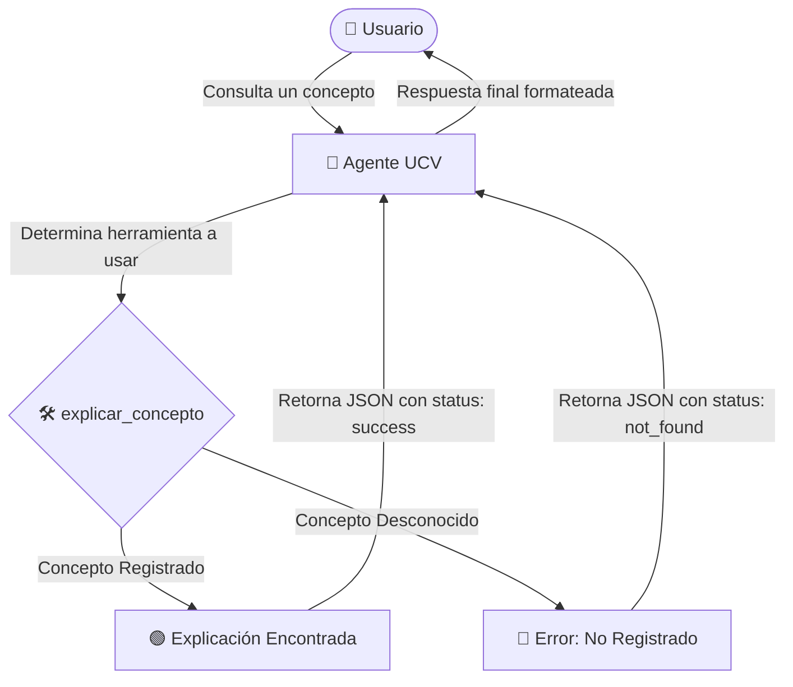

# 🎓 Laboratorio ADK UCV — Asistente Académico Inteligente

[](https://www.python.org/)
[](https://github.com/google/adk)
[](https://opensource.org/licenses/MIT)

Un potente paquete de Python diseñado para ofrecer un **asistente académico en español** utilizando la librería avanzada de agentes **`google-adk`** y el modelo **Gemini Flash**.

Este agente interactivo está preparado para explicar conceptos complejos de informática, bases de datos y algoritmos de forma sencilla y estructurada mediante herramientas personalizadas.

---

## 🚀 Arquitectura y Flujo de Trabajo

El siguiente diagrama ilustra cómo el usuario interactúa con el `Agente Académico` y cómo este decide utilizar la herramienta `explicar_concepto` para obtener respuestas estructuradas:



---

## ✨ Características Principales

*   🧠 **Agente Académico Autónomo**: Configurado con `Gemini Flash` para respuestas rápidas y asertivas.
*   🇪🇸 **Localización Completa**: Instrucciones y respuestas 100% en español con un tono pedagógico y simple.
*   🛠️ **Herramientas Personalizadas**: Integración directa con la función `explicar_concepto` para entregar datos altamente estructurados.
*   🧪 **Suite de Pruebas Unificadas**: Pruebas automáticas listas para verificar la robustez del agente y sus herramientas.

---

## 📂 Estructura del Proyecto

El repositorio está organizado siguiendo las mejores prácticas de estructuración de paquetes Python:

```bash
UCV-SI-lab8/
│
├── laboratorio-adk-ucv/
│   ├── agente_ucv/
│   │   ├── .adk/               # Base de datos de sesiones y caché del SDK
│   │   ├── __init__.py         # Inicializador del módulo
│   │   └── agent.py            # Definición del agente y herramientas (Core)
│   │
│   └── tests/
│       └── test_agent.py       # Pruebas unitarias con pytest
│
├── pyproject.toml              # Gestión de dependencias y empaquetado (Poetry)
├── poetry.lock                 # Versiones bloqueadas de dependencias
└── README.md                   # Documentación principal (este archivo)
```

---

## 🛠️ Instalación y Configuración

Sigue estos sencillos pasos para instalar el entorno de desarrollo y probar el asistente:

### 1. Clonar el repositorio y acceder
Accede al directorio del proyecto en tu máquina local:
```bash
cd c:\Users\User\Repositorios\UCV-SI-lab8
```

### 2. Instalar dependencias con Poetry
Asegúrate de tener [Poetry](https://python-poetry.org/) instalado y ejecuta:
```bash
poetry install
```

### 3. Configurar variables de entorno
Crea un archivo `.env` en la raíz del proyecto para configurar tu API Key de Google Gemini:
```env
GEMINI_API_KEY=tu_api_key_aqui
```

---

## 💻 Uso Básico

Importa y utiliza el asistente académico en tus propios scripts de la siguiente manera:

```python
from laboratorio_adk_ucv.agente_ucv.agent import explicar_concepto

# Consultar un concepto registrado
resultado = explicar_concepto("api")
print(resultado)
```

### Salida Esperada:
```json
{
  "status": "success",
  "explicacion": "Una API permite comunicación entre sistemas."
}
```

---

## 🔬 Diseño Técnico del Agente

El agente está definido en [agent.py](file:///c:/Users/User/Repositorios/UCV-SI-lab8/laboratorio-adk-ucv/agente_ucv/agent.py) y utiliza la siguiente especificación:

| Parámetro | Configuración | Descripción |
| :--- | :--- | :--- |
| **Model** | `gemini-flash-latest` | Modelo de lenguaje ultra-rápido para respuestas interactivas. |
| **Name** | `agente_ucv` | Identificador interno del agente académico. |
| **Description** | `Agente académico UCV` | Breve descripción del rol del agente. |
| **Language** | `Español (Simple)` | Instrucción para comunicarse con claridad y sencillez. |
| **Tools** | `explicar_concepto` | Herramienta para recuperar explicaciones predefinidas. |

### Diccionario de Conceptos Soportados

Actualmente, el sistema soporta explicaciones directas para los siguientes términos:

| Concepto | Explicación en el Sistema |
| :--- | :--- |
| **api** | Una API permite comunicación entre sistemas. |
| **algoritmo** | Un algoritmo es una secuencia de pasos. |
| **base de datos** | Una base de datos almacena información. |

---

## 🧪 Pruebas Unitarias

Hemos implementado una suite completa de pruebas unitarias en [test_agent.py](file:///c:/Users/User/Repositorios/UCV-SI-lab8/laboratorio-adk-ucv/tests/test_agent.py). Puedes verificar la integridad del proyecto ejecutando:

```bash
poetry run pytest
```

### Qué verifican las pruebas:
1.  **Conceptos Existentes**: Valida que devuelva `status: success` y la definición correcta.
2.  **Conceptos Inexistentes**: Valida que devuelva `status: not_found` y un mensaje preventivo.
3.  **Normalización de Texto**: Asegura que el buscador sea insensible a mayúsculas y espacios en blanco.
4.  **Configuración del Agente**: Verifica que el objeto `root_agent` tenga el nombre, modelo e instrucciones correctas.

---

## 🎯 Recomendaciones de Expansión

Para llevar este laboratorio al siguiente nivel:
*   ➕ **Añadir más Conceptos**: Ampliar el diccionario interno de `explicar_concepto` en `agent.py` para cubrir más temas de ingeniería de software.
*   🌐 **Integrar Consultas Externas**: Permitir al agente consultar a la Web o a una base de datos real si el concepto no está en el diccionario predefinido.
*   🖥️ **Interfaz de Chat**: Crear una pequeña interfaz de consola o web (usando Streamlit) para interactuar directamente con `root_agent`.

---

> [!NOTE]
> Este proyecto forma parte del Laboratorio N° 8 del curso de Sistemas Inteligentes de la **Universidad César Vallejo (UCV)**.
